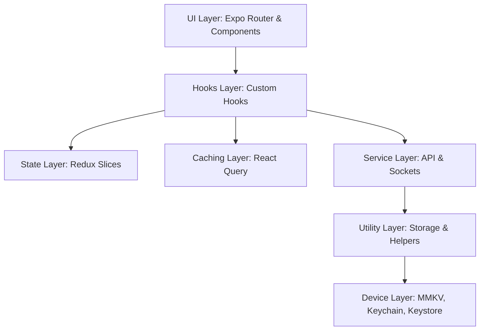

# Zoopol (OneDayJob) Mobile Application

[](https://reactnative.dev/)
[](https://expo.dev/)
[](https://www.typescriptlang.org/)
[](https://redux-toolkit.js.org/)
[](https://maestro.mobile.dev/)

Zoopol (internally referred to as **OneDayJob**) is a premium, feature-rich mobile application built with React Native and Expo SDK 54. The application is designed to solve the friction of matching local employers with on-demand, temporary gig workers (e.g., helpers, daily laborers, trade professionals) for short-term tasks. It streamlines the lifecycle of finding, hiring, tracking, communicating, and paying for one-day jobs securely and in real time.

---

## 📌 Table of Contents
- [Overview](#-overview)
- [Key Features](#-key-features)
- [Tech Stack](#-tech-stack)
- [Architecture & Design Pattern](#-architecture--design-pattern)
- [Folder Structure](#-folder-structure)
- [Getting Started](#-getting-started)
- [Environment Variables](#-environment-variables)
- [Key Libraries & Rationale](#-key-libraries--rationale)
- [Design Decisions](#-design-decisions)
- [Performance Optimization](#-performance-optimization)
- [Security Measures](#-security-measures)
- [Screenshots](#-screenshots)
- [Future Improvements](#-future-improvements)
- [Author](#-author)

---

## 🔍 Overview

The traditional gig economy often leaves short-term, daily laborers and employers exposed to trust issues, coordination failures, delayed payments, and communication gaps. **Zoopol** addresses these issues by providing a centralized platform tailored for one-day jobs:
* **For Employers:** A platform to easily post job requirements with description, budget, and time slots; filter and select applicants; track job progress with active timers; and pay securely using local payment gateways.
* **For Workers:** A location-aware feed to discover jobs in their immediate vicinity; apply with a single tap; converse directly with employers; log work using real-time timers; and withdraw earnings securely to bank accounts or UPI IDs.
* **Problem Solved:** Simplifies local recruitment, coordinates real-time actions, enforces safety via blocking/reporting features, provides offline resilience for poor connectivity, and ensures secure financial settlements.

---

## 🚀 Key Features

### 👤 Authentication & Onboarding
* **OTP Sign-in:** Secure phone number authentication using a 6-digit OTP verified via SMS endpoints.
* **Profile Completion:** Flexible onboarding flow routing users based on user-type selection (Employer vs. Worker), and requiring name, location, and key credentials before allowing app access.
* **KYC & Verification:** Dynamic verification request flow to prevent fraudulent activities.

### 📍 Location & Navigation
* **Geo-Fencing & Radius Searches:** Integrates coordinate tracking to display localized job listings based on proximity.
* **Address Search:** Integrated address autocompletion via Google Places API.
* **Active Proximity Tracking:** Robust background/foreground geolocation synchronization.

### 💼 Job Lifecycle Management
* **Job Postings:** Custom forms supporting category categorization, budgets, timeline choices, lists of requirements, and photo uploads.
* **Job Discovery Feed:** Dual view supporting paginated lists with criteria sorting (price, distance) and search text matching.
* **Applications & Matching:** Direct worker bidding/application mechanism, letting employers review list profiles to select or reject candidates.
* **Job Timer:** Live on-duty timer sync, keeping both parties in agreement regarding hours worked.

### 💬 Real-Time Communication
* **Bidirectional Live Chat:** Real-time messages using Socket.io and high-fidelity chat bubbles.
* **Interactive Indicators:** In-chat actions, read statuses, and direct layout links.

### 💳 Payment Integration
* **Razorpay Payment Gateway:** Robust payment collection for employers.
* **Worker Payout Registration:** Allows workers to link their Bank Accounts or register a UPI ID for automated settlement routing.
* **Transaction Ledger:** Consolidated visual summaries of incoming and outgoing transaction logs.

### 📴 Offline Resilience
* **Persistent Mutation Queue:** Queues data modification operations (such as applying, posting, or updating addresses) when NetInfo detects connection drops.
* **Sync Engine:** Automatically replays queued events in FIFO order once internet connectivity is restored, featuring interactive synchronization notifications.

### 🌐 System Configurations
* **Multi-Language Support (i18n):** Complete translation system dynamically supporting multiple locales.
* **Dual Theme Engine:** Dark and Light styling states saved directly to the device storage.

---

## 🛠️ Tech Stack

### Frontend & Mobile Core
* **Framework:** React Native (v0.81.5), Expo SDK 54 (New Architecture enabled)
* **Routing:** Expo Router v6 (Hybrid File-based & Native Stack navigation)
* **Styling:** Vanilla StyleSheet styling using tokenized HSL and hex palettes

### Backend & API
* **Runtime & Framework:** Node.js, Express.js (TypeScript)
* **Database:** MongoDB (via Mongoose ODM)
* **WebSockets:** Socket.io (Socket.io-client on Mobile)

### State Management & Querying
* **Global Store:** Redux Toolkit + Redux Persist (Offline Queue & Auth Slices)
* **Query Cache:** React Query (TanStack Query v5) for HTTP requests caching and status invalidation
* **Key-Value Store:** React Native MMKV (High performance local key-value storage)

### Native & Hardware Integrations
* **Security & Tokens:** Expo Secure Store, Expo Crypto
* **Location:** Expo Location, React Native Google Places Autocomplete
* **Media:** Expo Image Picker, Expo Image (highly optimized component)
* **Notifications:** Expo Notifications, Notifee (granular control over channel setups)
* **Haptics:** Expo Haptics (micro-vibrations for interactive actions)

### Developer & Testing Tools
* **Build toolchain:** EAS (Expo Application Services) Build & CLI
* **UI Testing:** Maestro (Declarative YAML-based E2E automation)
* **Local environment:** Expo Dev Client

---

## 🏗️ Architecture & Design Pattern

Zoopol follows a **Layered Clean Architecture** that separates UI layouts, state containers, business logic services, and persistence layers. This separation ensures the codebase remains modular, unit-testable, and scalable.



### Core Architecture Layers:
1. **Presentation Layer (`app/`, `components/`)**:
   * Uses React Native functional components.
   * Leverages custom styles linked to a centralized color utility file (`constants/Colors.ts`).
   * Avoids direct database or API fetching logic inside views; instead, relies on custom hooks.
2. **Business Logic Layer (`hooks/`)**:
   * Encapsulates stateful workflows (e.g., `useActiveJob`, `useChat`, `useJobs`).
   * Acts as the glue between presentation elements and data querying layers.
3. **Data & Cache Layer (`redux/`, `services/`, `@tanstack/react-query`)**:
   * **Redux Toolkit**: Manages synchronous global states like user authentication sessions (`authReducers`), current job timer states (`jobReducer`), and the offline request queue (`offlineSyncSlice`).
   * **React Query**: Handles asynchronous remote server synchronization, caching, polling, and cache invalidation.
   * **API Client (`services/api.tsx`)**: An Axios-based HTTP client managing token decoration, refresh logic, error transformations, and offline interception.
4. **Persistence & Hardware Interface (`utilities/`)**:
   * Wraps native iOS and Android storage engines.
   * Integrates hardware services like Location Providers, Biometrics, and Push Notification channels.

---

## 📂 Folder Structure

```
OneDayJob/
├── android/                   # Native Android project configuration files
├── ios/                       # Native iOS project configuration files
├── app/                       # Routing screens and navigation setups (Expo Router)
│   ├── (auth)/                # Authentication screens (Login, OTP verification, SignUp)
│   ├── (onboarding)/          # User classification and profile completion screens
│   ├── (tabs)/                # Main bottom-tab navigators (Home, Status, PostJob, Chat, Profile)
│   ├── main/                  # Secondary screens (JobDetails, Timer, BankAccount, Settings, etc.)
│   └── navigation/            # Custom stack navigators (Intro, Onboarding, KYC, MainStack Layouts)
├── components/                # Reusable presentation and layout components
│   ├── CustomAlert/           # Context-driven custom confirmation alerts
│   ├── CustomTabBar/          # Custom bottom navigation bar component
│   ├── OfflineIndicator/      # Dynamic notification banner for offline states
│   └── paymentModal/          # Razorpay payment container and inputs
├── constants/                 # Centralized configuration variables (Colors, Dimensions, Job Constants)
├── contexts/                  # React Contexts (Theme toggle, App-wide Notifications)
├── e2e/                       # Maestro E2E test suites (YAML configuration files)
├── hooks/                     # Custom hooks isolating presentation from business logic
├── offline/                   # Offline queue logic, network listeners, and sync bridges
├── redux/                     # Redux Toolkit store definition and persisted MMKV engines
├── services/                  # Network layer (Axios API client, WebSocket Client, Locations)
├── themes/                    # Visual assets like fonts and theme configurations
├── types/                     # Shared TypeScript interface and model declarations
└── utilities/                 # Cross-cutting concerns (SecureStore, MMKVStore, Encryption, Translators)
```

---

## 🏁 Getting Started

### Prerequisites
* **Node.js**: v18.x or v20.x
* **NPM** or **Yarn**
* **Expo CLI** (`npm install -g expo-cli`)
* **iOS Simulator / Android Emulator** or a physical device running the **Expo Go** / **Dev Client**
* **Maestro CLI** (Optional, for running E2E tests)

### Installation

1. **Clone the repository:**
   ```bash
   git clone https://github.com/your-username/OneDayJob.git
   cd OneDayJob
   ```

2. **Install dependencies:**
   ```bash
   npm install
   # Or if using yarn:
   yarn install
   ```

3. **Configure native dependencies:**
   ```bash
   npx expo prebuild
   ```

### Running Locally

* **Start the development server:**
   ```bash
   npm start
   # Or using expo directly:
   npx expo start
   ```

* **Launch on iOS Simulator:**
   ```bash
   npm run ios
   # Or:
   npx expo run:ios
   ```

* **Launch on Android Emulator:**
   ```bash
   npm run android
   # Or:
   npx expo run:android
   ```

* **Run E2E UI Tests (Maestro):**
   Make sure your simulator/emulator is running, then execute:
   ```bash
   maestro test e2e/login.yaml
   ```

---

## 🔒 Environment Variables

Create a `.env` file in the root of the mobile project and configure the following variables. Do not commit this file to public version control.

```env
# API Endpoint URL
EXPO_PUBLIC_API_URL=https://your-backend-api-url.com/api/

# Razorpay Test / Production Keys
EXPO_PUBLIC_RAZORPAY_KEY_ID=rzp_test_your_razorpay_key_id

# Local MMKV Encryption Seed (32-character hexadecimal fallback)
EXPO_MMKV_ENCRYPTION_KEY=your_32_char_fallback_key_for_testing

# Google Maps / Places API Keys
EXPO_PUBLIC_GOOGLE_PLACES_API_KEY=AIzaSy_your_google_places_api_key
```

---

## 📦 Key Libraries & Rationale

* **`react-native-mmkv`**: Replaces the sluggish `AsyncStorage` with an ultra-fast C++ JSI binding layer. Used for storing large, structured datasets like user logs, locales, and theme settings.
* **`expo-secure-store` & `expo-crypto`**: Manages device-level Keychain (iOS) and Keystore (Android). It securely handles user JWT tokens and dynamically generates unique keys to encrypt the MMKV database instance.
* **`@tanstack/react-query`**: Manages server state. It automates background refetching, handles pagination cache, and removes the need for boilerplate fetching actions in Redux.
* **`socket.io-client`**: Establishes a lightweight TCP connection to the backend, enabling bidirectional, real-time text transmissions and typing status indicators in active chats.
* **`react-native-razorpay`**: Bridges native SDK payment sheets on Android and iOS to support UPI, Net Banking, and Cards.
* **`@notifee/react-native`**: Provides granular API control to customize notification visuals (e.g., custom sounds, status bar badges, large icons) on native systems.
* **`react-native-reanimated` & `lottie-react-native`**: Used to build fluid user interface transitions, custom animated loaders, and micro-haptic responses.

---

## 🎨 Design Decisions

* **Encrypted Cache Partitioning**: Unlike generic applications that store local keys in plain text, Zoopol uses a hybrid security design. It dynamically generates a unique 256-bit AES key per device using `expo-crypto`, registers it in OS-level hardware sandboxes via `expo-secure-store`, and wraps `react-native-mmkv` with it.
* **Declarative Routing Gates**: Rather than rendering screens on top of each other, the routing root component (`app/navigation/index.tsx`) acts as an active gatekeeper. It evaluates the user's state in real time, routing them directly through the proper onboarding stack, verification queue, or main tab bar.
* **Transactional Offline Syncing**: Network write calls (e.g., job postings) are intercepted during offline states. They are not discarded; instead, they are converted into serialized payloads, queued in order, saved to the encrypted disk, and replayed sequentially when the network becomes reachable.
* **Tab-Specific Error Isolation**: To prevent a javascript error in one screen from crashing the entire app, each main tab in `app/(tabs)/_layout.tsx` is wrapped in a custom `ErrorBoundary` component, ensuring isolated recovery blocks.

---

## ⚡ Performance Optimization

* **Zero-Bridge Storage Read/Write**: By shifting database operations from async channels to synchronous MMKV bindings, visual data loading (like user profile parameters) completes instantly without freezing the single UI thread.
* **Smart Server State Caching**: React Query prevents redundant network calls by caching GET queries (such as listing categories). Cache limits are updated dynamically based on view focus events.
* **Dynamic Multi-part Uploads**: Media attachments are optimized locally. They are transformed using custom image pickers and sent via multi-part data bodies, skipping base64 encoding bloat.
* **Lazy Module Hydration**: Inside the offline sync engine, Axios references are imported dynamically (`await import('../services/api')`). This avoids cyclic reference chains and improves app startup performance.

---

## 🔐 Security Measures

* **Device-Level DB Encryption**: AES-256 encryption protects the MMKV storage files, preventing memory dump attacks on rooted/jailbroken devices.
* **Hardware-Backed Token Security**: JWT credentials (Access and Refresh tokens) are kept exclusively within iOS Keychain / Android Keystore partitions.
* **Automatic Silent Token Refresh**: The Axios response interceptor intercepts `401 Unauthorized` errors. It uses the stored Refresh token to request a new session in the background and retries the failed API call without user interruption.
* **Strict CORS & HTTPs Enforcement**: All API communication runs over encrypted TLS links (`HTTPS`/`WSS`) and enforces credentials transmission permissions.
* **Account Suspension Interceptors**: If a user is flagged for policy violation (UGC requirements), the `403 Forbidden` response interceptor triggers immediately, logging the user out and redirecting them to a suspended account warning screen.

---

## 📸 Screenshots

| Onboarding Flow | Phone OTP Login | Job Proximity Feed |
| :---: | :---: | :---: |
| *[Screenshot Placeholder]* | *[Screenshot Placeholder]* | *[Screenshot Placeholder]* |

| Job Posting Form | Real-Time Chat | Razorpay Payment Modal |
| :---: | :---: | :---: |
| *[Screenshot Placeholder]* | *[Screenshot Placeholder]* | *[Screenshot Placeholder]* |

---

## 🔮 Future Improvements

* **Background Sync Worker**: Integrate a native task manager to sync the offline queue even when the application is closed or minimized.
* **Offline Map Caching**: Cache local map tiles to support job location mapping without active mobile data.
* **Interactive Verification Dashboard**: Support real-time KYC document uploads with on-device OCR preprocessing.
* **Advanced Matchmaking Algorithm**: Alert workers matching specific categories using automated server-side geographic calculations.
* **Maestro Test Suite Expansion**: Expand the automated UI test suites to cover edge cases, payment failure handling, and multi-user chat sessions.

---

## 👤 Author

Developed and maintained by the **Zoopol Engineering Team**. For contributions, bug reports, or feature requests, please submit an issue or open a pull request on the repository.
